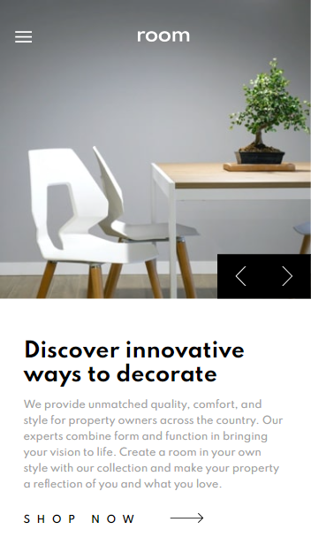

# Frontend Mentor - Room homepage solution

This is a solution to the [Room homepage challenge on Frontend Mentor](https://www.frontendmentor.io/challenges/room-homepage-BtdBY_ENq).

## The challenge

The purpose of the challenge was to copy the layout & interactivity presented on challenge pictures starting from simple text file. From this point I had to create proper HTML structure, add layout with CSS and interactivity using JS.

Users should be able to:

- View the optimal layout for the site depending on their device's screen size
- See hover states for all interactive elements on the page
- Navigate the slider using their mouse/trackpad

## Screenshot

## Links

Live Site URL: https://amstelmach.github.io/room-homepage/

## Built with

- Semantic HTML5 markup
- CSS /Flexbox/ Grid
- Mobile-first workflow
- Vanilla JavaScript

## Further development

- Page responsive for iPads
